# SkillSync 2.0 - Workflow Documentation

## 🔄 System Workflows Overview

This document outlines the complete user workflows, system processes, and data flows within SkillSync 2.0. Each workflow is designed to provide seamless user experiences while maintaining system efficiency and reliability.

## 🚀 User Journey Workflows

### 1. User Onboarding Workflow

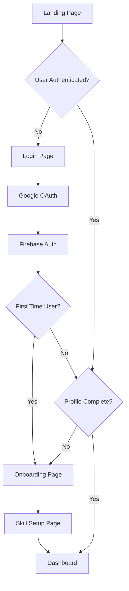

**Detailed Steps:**

1. **Landing Page Access**
   - User visits application
   - System checks authentication status
   - Displays marketing content and login options

2. **Authentication Process**
   ```javascript
   // AuthContext.jsx
   const signInWithGoogle = async () => {
     const result = await authService.signInWithGoogle();
     localStorage.setItem('skillsync_user', JSON.stringify(result.user));
     return result;
   };
   ```

3. **Profile Setup Flow**
   ```javascript
   // OnboardingPage.jsx
   const handleProfileSubmit = async (profileData) => {
     await firebaseService.updateUserStats(currentUser.uid, {
       ...profileData,
       skillsSetup: false,
       onboardingComplete: true
     });
     navigate('/skill-setup');
   };
   ```

4. **Skill Configuration**
   ```javascript
   // SkillSetupPage.jsx
   const handleSkillSetup = async (skills) => {
     await firebaseService.updateUserStats(currentUser.uid, {
       skills: skills,
       skillsSetup: true,
       totalSkills: Object.keys(skills).length
     });
     navigate('/dashboard');
   };
   ```

### 2. Daily Learning Workflow

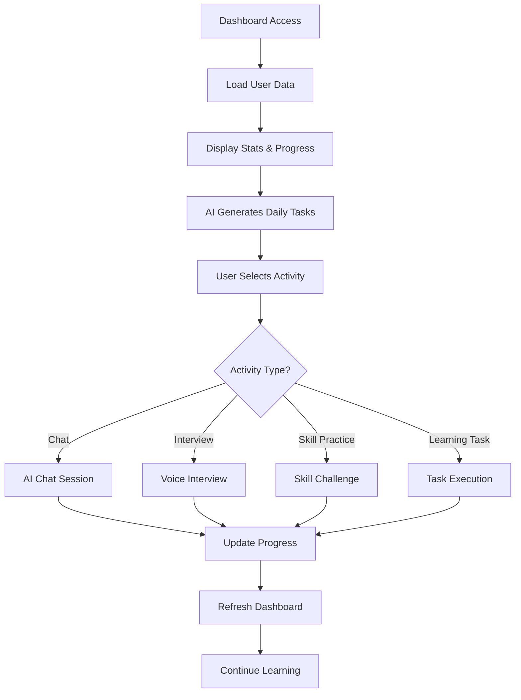

**Implementation Details:**

1. **Dashboard Data Loading**
   ```javascript
   // useUserData.js
   const loadUserData = async () => {
     const data = await firebaseService.getUserStats(currentUser.uid);
     const { mastered, total } = calculateSkillMastery(data?.skills);
     
     setUserData({
       ...data,
       skillsMastered: mastered,
       totalSkills: total
     });
   };
   ```

2. **AI Task Generation**
   ```javascript
   // firebaseService.js
   const generateAILearningTasks = async (userId, userSkills, interests, goals) => {
     const aiService = await import('./aiService');
     const prompt = `Generate 5 learning tasks for: ${JSON.stringify(userSkills)}`;
     const response = await aiService.generateResponse(prompt);
     return parseAITasks(response, userSkills);
   };
   ```

3. **Progress Tracking**
   ```javascript
   // Dashboard.jsx
   const handleTaskCompletion = async (taskId) => {
     await firebaseService.completeTask(currentUser.uid, taskId);
     await firebaseService.incrementStreak(currentUser.uid);
     refresh(); // Reload dashboard data
   };
   ```

### 3. AI Chat Interaction Workflow

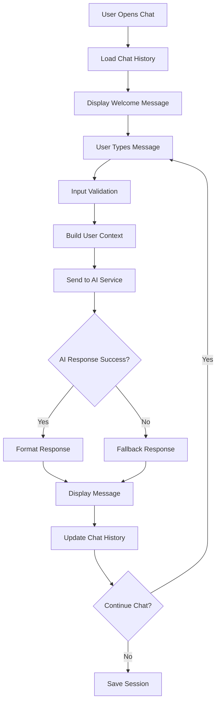

**Technical Implementation:**

1. **Context Building Process**
   ```javascript
   // aiService.js
   const buildSmartUserContext = async (message, userId) => {
     const userData = await firebaseService.getUserStats(userId);
     const context = [
       `User: ${userData.name}`,
       `Experience: ${userData.experience}`,
       `Skills: ${Object.keys(userData.skills).join(', ')}`,
       `Goals: ${userData.careerGoals}`,
       `Current Focus: ${findWeakestSkill(userData.skills)}`
     ];
     
     return buildContextualPrompt(context, message);
   };
   ```

2. **AI Response Processing**
   ```javascript
   // ModernAIChat.jsx
   const sendMessage = async () => {
     const userMessage = { role: 'user', content: input, timestamp: new Date() };
     setMessages(prev => [...prev, userMessage]);
     setLoading(true);
     
     try {
       const response = await aiService.chatWithAI(input, '', currentUser?.uid);
       setMessages(prev => [...prev, { 
         role: 'assistant', 
         content: response, 
         timestamp: new Date() 
       }]);
     } catch (error) {
       // Fallback response handling
       setMessages(prev => [...prev, getFallbackMessage()]);
     } finally {
       setLoading(false);
     }
   };
   ```

### 4. Voice Interview Workflow

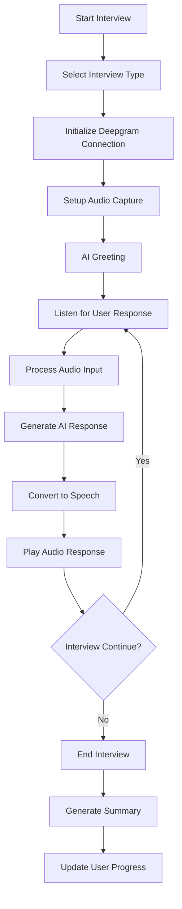

**Technical Flow:**

1. **Interview Initialization**
   ```javascript
   // deepgramVoiceAgent.js
   const startInterview = async (type, userId, onMessage, onStatusChange, userData) => {
     this.currentInterview = { type, userId, startTime: Date.now() };
     
     await this.connectToDeepgram();
     await this.setupAudio();
     
     this.onStatusChange?.({ isConnected: true, isListening: true });
     return true;
   };
   ```

2. **Real-time Audio Processing**
   ```javascript
   // Audio processing pipeline
   const setupAudio = async () => {
     const stream = await navigator.mediaDevices.getUserMedia({ 
       audio: { 
         sampleRate: 24000,
         channelCount: 1,
         echoCancellation: true,
         noiseSuppression: true
       } 
     });
     
     const processor = audioContext.createScriptProcessor(4096, 1, 1);
     processor.onaudioprocess = (event) => {
       const audioData = convertToInt16(event.inputBuffer.getChannelData(0));
       this.connection.send(audioData);
     };
   };
   ```

3. **Interview Completion**
   ```javascript
   const endInterview = () => {
     const summary = {
       duration: Date.now() - this.currentInterview.startTime,
       type: this.currentInterview.type,
       questionsAnswered: this.conversation.length
     };
     
     // Update user statistics
     firebaseService.updateUserStats(userId, {
       interviewsPassed: increment(1),
       lastInterviewDate: new Date().toISOString()
     });
     
     return summary;
   };
   ```

## 🔄 System Process Workflows

### 1. Data Synchronization Workflow

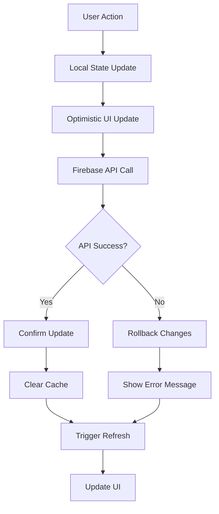

**Implementation:**

```javascript
// firebaseService.js
const updateUserStats = async (userId, updates) => {
  try {
    // Optimistic update
    this.cache.set(userId, { ...this.cache.get(userId), ...updates });
    
    // Firebase update
    await updateDoc(doc(db, 'users', userId), updates);
    
    // Clear cache to force refresh
    this.cache.delete(this.getCacheKey(userId, 'stats'));
  } catch (error) {
    // Rollback optimistic update
    this.cache.delete(this.getCacheKey(userId, 'stats'));
    throw error;
  }
};
```

### 2. Skill Progress Tracking Workflow

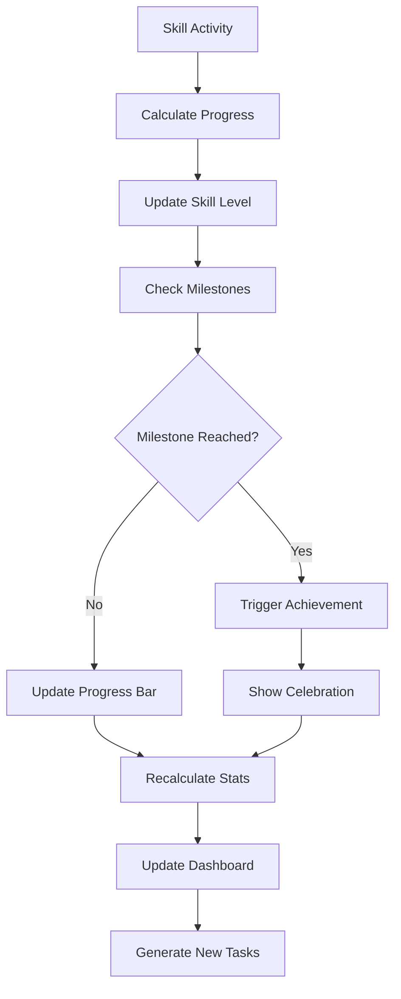

**Technical Implementation:**

```javascript
// AISkillTracker.jsx
const handleSkillUpdate = async (skill, newProgress) => {
  const oldProgress = skills[skill]?.current || 0;
  
  // Update skill progress
  await onSkillUpdate(skill, newProgress);
  
  // Check for milestones
  const milestones = [25, 50, 75, 90];
  const reachedMilestone = milestones.find(m => 
    oldProgress < m && newProgress >= m
  );
  
  if (reachedMilestone) {
    showAchievement(`${skill} - ${reachedMilestone}% Mastery!`);
    generateSkillChallenge(skill, reachedMilestone);
  }
};
```

### 3. AI Response Generation Workflow

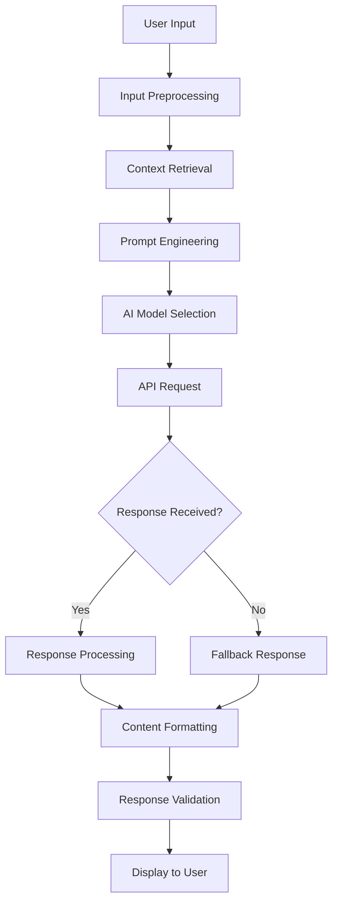

**Process Details:**

1. **Input Preprocessing**
   ```javascript
   const preprocessInput = (input) => {
     return input
       .trim()
       .replace(/\s+/g, ' ')
       .substring(0, 1000); // Limit input length
   };
   ```

2. **Context Retrieval**
   ```javascript
   const buildContext = async (userId, message) => {
     const [profile, skills, tasks, history] = await Promise.all([
       getUserProfile(userId),
       getUserSkills(userId),
       getRecentTasks(userId),
       getChatHistory(userId, 5) // Last 5 messages
     ]);
     
     return formatContext({ profile, skills, tasks, history });
   };
   ```

3. **Response Processing**
   ```javascript
   const processResponse = (rawResponse) => {
     return rawResponse
       .replace(/\*\*(.*?)\*\*/g, '<strong>$1</strong>')
       .replace(/\n\n/g, '</p><p>')
       .replace(/- (.*?)$/gm, '<li>$1</li>');
   };
   ```

## 📊 Analytics & Monitoring Workflows

### 1. User Activity Tracking Workflow

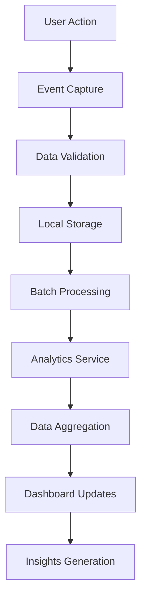

**Implementation:**

```javascript
// Analytics tracking
const trackUserActivity = (action, data) => {
  const event = {
    userId: currentUser.uid,
    action: action,
    data: data,
    timestamp: Date.now(),
    sessionId: getSessionId()
  };
  
  // Store locally first
  const events = JSON.parse(localStorage.getItem('analytics_events') || '[]');
  events.push(event);
  localStorage.setItem('analytics_events', JSON.stringify(events));
  
  // Batch send every 10 events or 5 minutes
  if (events.length >= 10 || shouldFlushEvents()) {
    sendAnalyticsBatch(events);
    localStorage.removeItem('analytics_events');
  }
};
```

### 2. Performance Monitoring Workflow

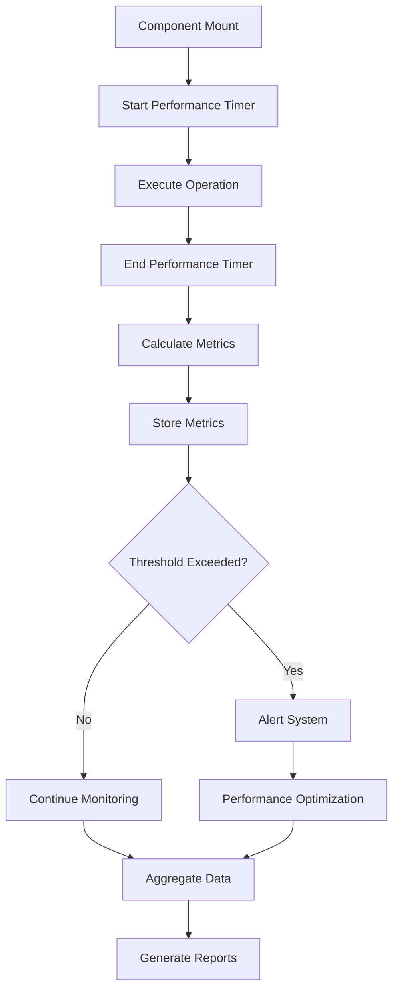

**Monitoring Implementation:**

```javascript
// Performance monitoring hook
const usePerformanceMonitor = (componentName) => {
  const startTime = useRef(Date.now());
  
  useEffect(() => {
    return () => {
      const endTime = Date.now();
      const duration = endTime - startTime.current;
      
      trackPerformance(componentName, {
        mountTime: duration,
        timestamp: endTime
      });
      
      if (duration > PERFORMANCE_THRESHOLD) {
        reportSlowComponent(componentName, duration);
      }
    };
  }, [componentName]);
};
```

## 🔄 Error Handling Workflows

### 1. Error Recovery Workflow

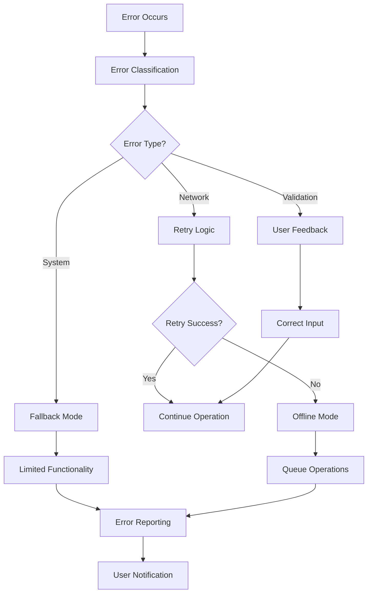

**Error Handling Implementation:**

```javascript
// Comprehensive error handler
const handleError = async (error, context) => {
  const errorInfo = {
    message: error.message,
    stack: error.stack,
    context: context,
    userId: currentUser?.uid,
    timestamp: Date.now()
  };
  
  // Classify error
  if (error.name === 'NetworkError') {
    return handleNetworkError(error, context);
  } else if (error.name === 'ValidationError') {
    return handleValidationError(error, context);
  } else {
    return handleSystemError(error, context);
  }
};

const handleNetworkError = async (error, context) => {
  // Implement retry logic
  for (let i = 0; i < 3; i++) {
    await delay(1000 * Math.pow(2, i)); // Exponential backoff
    try {
      return await retryOperation(context);
    } catch (retryError) {
      if (i === 2) throw retryError;
    }
  }
};
```

## 🚀 Deployment Workflow

### 1. CI/CD Pipeline Workflow

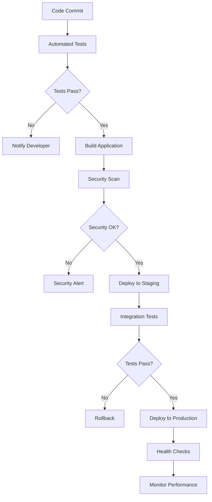

**Deployment Configuration:**

```javascript
// vite.config.js
export default defineConfig({
  build: {
    target: 'es2015',
    outDir: 'dist',
    sourcemap: true,
    rollupOptions: {
      output: {
        manualChunks: {
          vendor: ['react', 'react-dom'],
          ai: ['@deepgram/sdk', 'axios'],
          ui: ['framer-motion', 'lucide-react']
        }
      }
    }
  },
  define: {
    'process.env.NODE_ENV': JSON.stringify(process.env.NODE_ENV)
  }
});
```

## 🔧 Maintenance Workflows

### 1. Data Backup Workflow

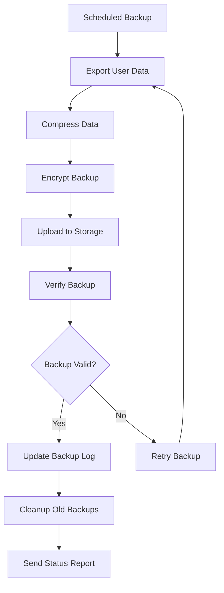

### 2. Cache Management Workflow

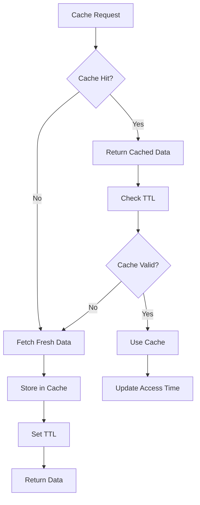

**Cache Implementation:**

```javascript
// Intelligent caching system
class CacheManager {
  constructor() {
    this.cache = new Map();
    this.ttl = 30000; // 30 seconds
  }
  
  get(key) {
    const item = this.cache.get(key);
    if (!item) return null;
    
    if (Date.now() - item.timestamp > this.ttl) {
      this.cache.delete(key);
      return null;
    }
    
    item.accessCount++;
    item.lastAccess = Date.now();
    return item.data;
  }
  
  set(key, data) {
    this.cache.set(key, {
      data,
      timestamp: Date.now(),
      lastAccess: Date.now(),
      accessCount: 1
    });
    
    // Cleanup old entries
    this.cleanup();
  }
  
  cleanup() {
    const now = Date.now();
    for (const [key, item] of this.cache.entries()) {
      if (now - item.timestamp > this.ttl) {
        this.cache.delete(key);
      }
    }
  }
}
```

This comprehensive workflow documentation ensures smooth operation and maintenance of the SkillSync 2.0 platform across all user interactions and system processes.